# G-code Reader
A Gcode visulization and analysis tool written in python. It supports FDM Gcode, Stratasys Gcode and SLS Gcode. It can print a single layer, print multiple layers. It also can animate the printing of a single layer or multiple layers.

*Update: Add animation of printint process*

* Animation of Printint Single Layer in 2D
[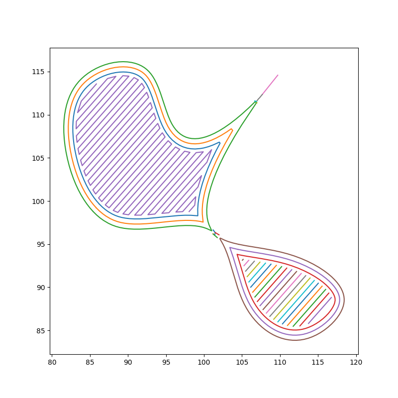](https://youtu.be/0pambiz2EeM)
**[click above figure to play]**

* Animation of Printing Multiple Layers in 3D
[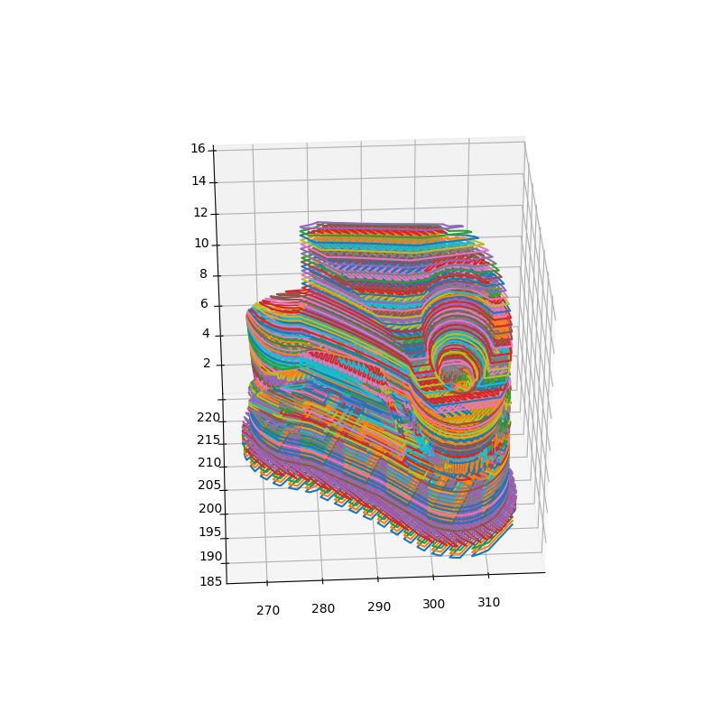](https://youtu.be/n16rB9qlLmw)
**[click above figure to play]**

* Plot a single layer in 2D

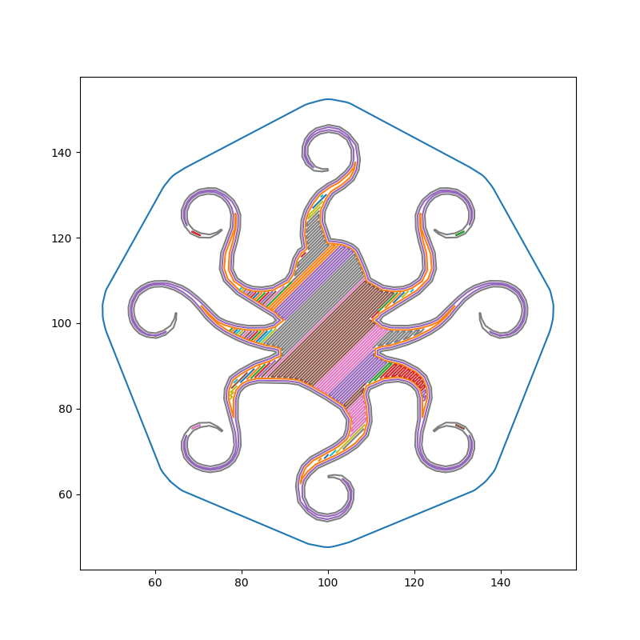
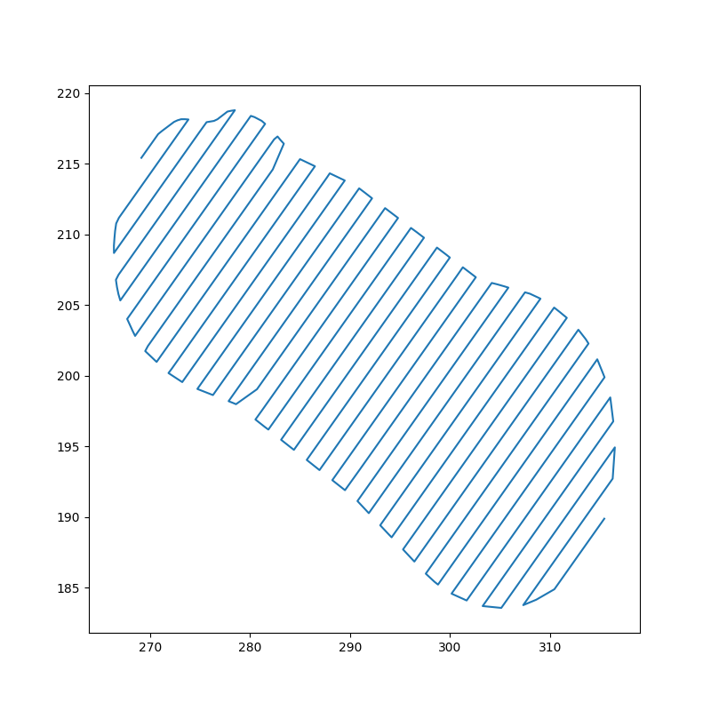

* Plot the whole part in 3D
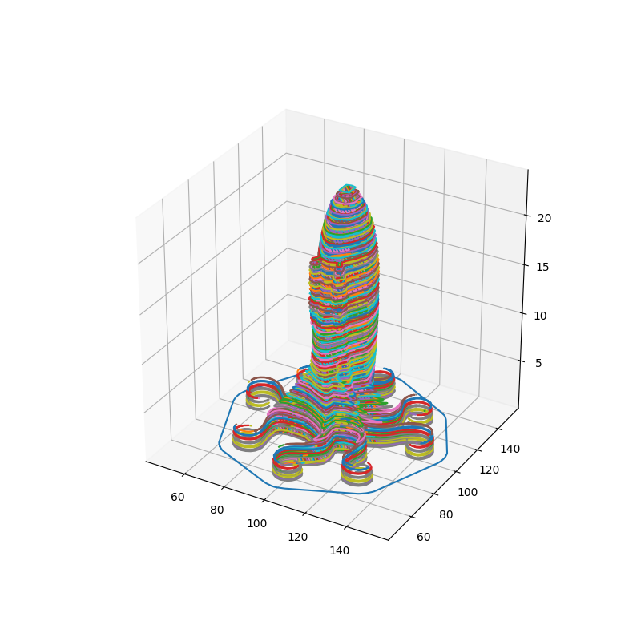

* Plot multiple layers in 3D
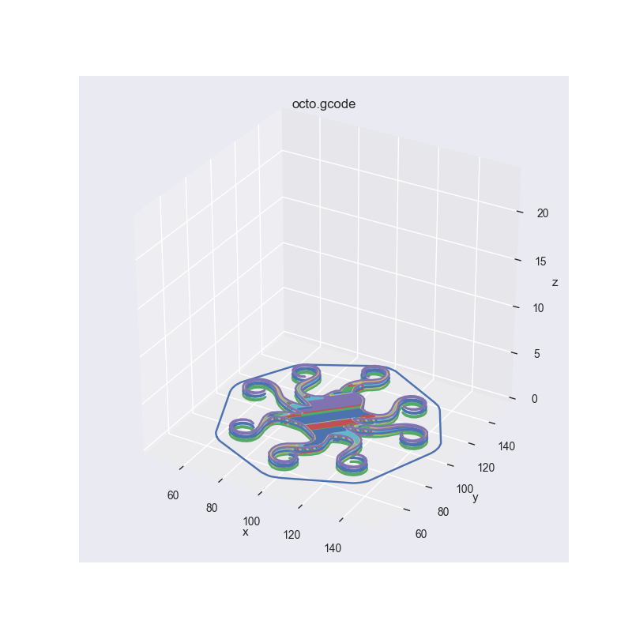
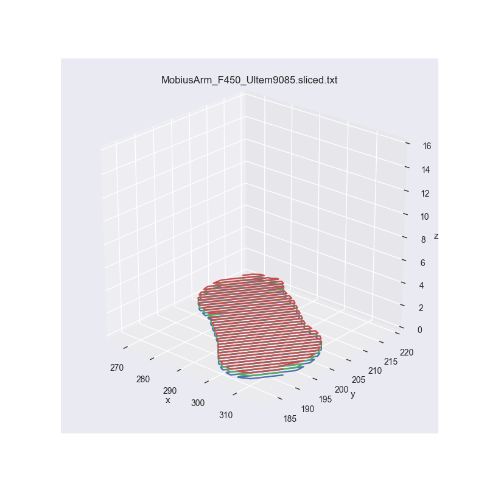

* Analysis of Process Plan
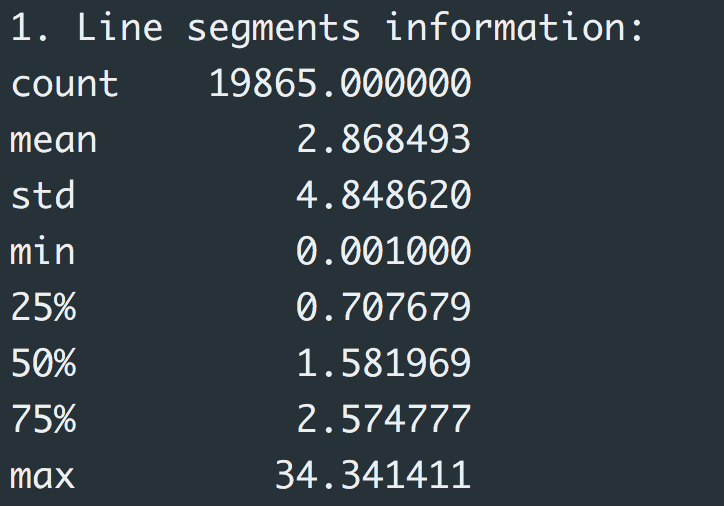
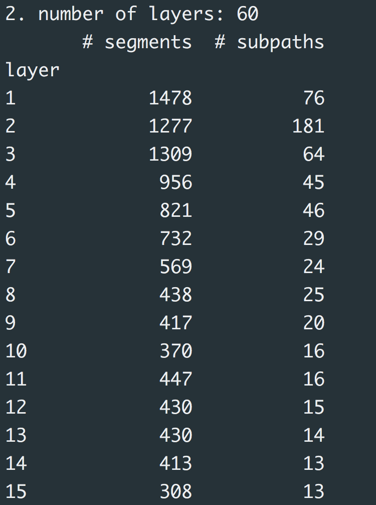
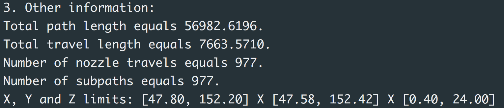
For L-PBF,
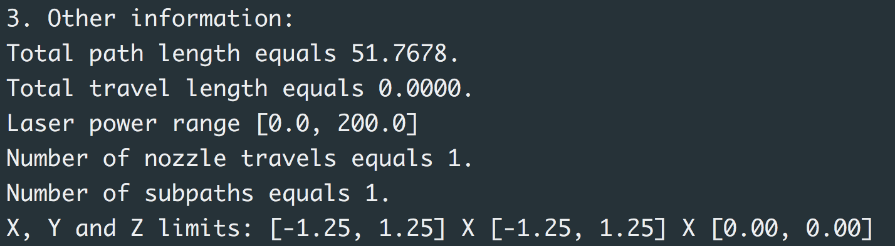

* Plot meshing

* Analysis of meshing
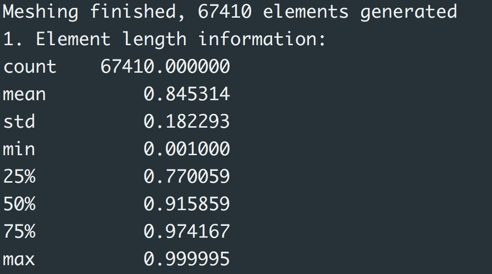
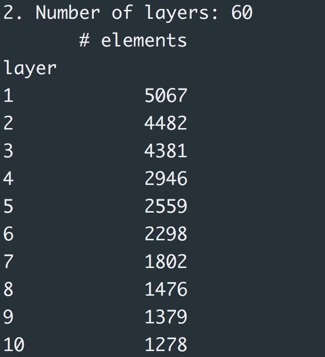